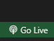

# Tech Store

🛒 Tienda en Línea de Productos Tecnológicos

Este proyecto es una tienda en línea enfocada en productos tecnológicos, diseñada para simular el flujo completo de un e-commerce de manera práctica y sencilla. Todo el manejo de usuarios, productos y apartados se realiza utilizando el LocalStorage del navegador, evitando la necesidad de una base de datos o backend.

## ⚙️ Funcionalidades principales

- **Autenticación de usuarios**: Los usuarios pueden registrarse e iniciar sesión. La información se guarda en el LocalStorage.
- **Catálogo de productos**: Muestra de productos con imagen, nombre, precio, descripción y stock.
- **Productos destacados y nuevos**: Secciones para resaltar productos.
- **Carrito de compras**: Los usuarios pueden agregar productos al carrito.
- **Gestión de inventario**: El stock de los productos se actualiza dinámicamente.
- **Página de detalles del producto**: Cada producto tiene su propia página con información detallada.
- **Flujo de pago**: Simulación de un proceso de pago.

## 🚀 Cómo empezar

### Clonar el repositorio

```bash
git clone <https://github.com/Ander2on21/Tech_store.git>
```


### Iniciar el proyecto

1.  Abre el proyecto en Visual Studio Code.
2.  Asegúrate de tener la extensión [Live Server](https://marketplace.visualstudio.com/items?itemName=ritwickdey.LiveServer) instalada.

3.  Posicionate en el archivo del proyecto `index.html` y en la parte de abajo te aparecerá el icono de Live Server y el texto "Go Live. 

 

4.  Esto abrirá el sitio en tu navegador web predeterminado.